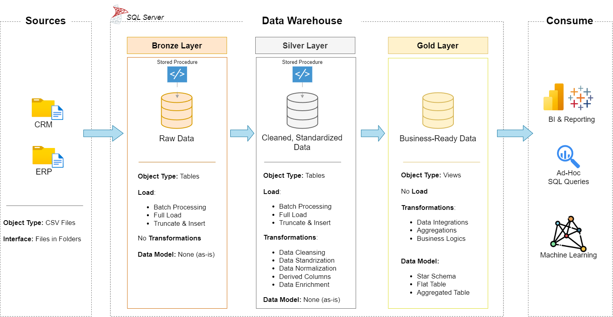

# Data Warehouse & Analytics Project

A hands-on **Data Warehouse and Analytics project** built with **SQL Server**, covering the complete data pipeline from raw data ingestion to analytical reporting.

## 🏗️ Architecture

The project follows a **Medallion Architecture** with three layers:

* **Bronze:** Raw data loaded from source CSV files.
* **Silver:** Cleaned, standardized, and transformed data.
* **Gold:** Business-ready data modeled using a **Star Schema** for analytics and reporting.



## 🚀 Project Scope

This project covers:

* Data Warehouse architecture
* ETL pipelines using SQL
* Data cleaning and transformation
* Data integration from multiple sources
* Dimensional data modeling
* Fact and Dimension tables
* Star Schema design
* Data quality checks
* SQL-based analytics and reporting

## 🛠️ Technologies

* **SQL Server**
* **SQL / T-SQL**
* **SSMS**
* **Draw.io**
* **Git & GitHub**

## 📂 Repository Structure

```text
data-warehouse-project/
│
├── datasets/              # Source CSV files
│
├── docs/                  # Documentation and diagrams
│   ├── data_architecture.drawio
│   ├── data_flow.drawio
│   ├── data_models.drawio
│   └── data_catalog.md
│
├── scripts/               # SQL scripts
│   ├── bronze/             # Raw data ingestion
│   ├── silver/             # Data cleaning and transformation
│   └── gold/               # Analytical data models
│
├── tests/                 # Data quality and validation scripts
│
└── README.md
```

## 🎯 Goals

The main goal of this project is to practice and demonstrate practical skills in:

* Data Engineering
* Data Warehousing
* ETL Development
* SQL Development
* Data Modeling
* Data Analytics

## 📊 Analytics

The final data warehouse can be used to analyze:

* Customer behavior
* Product performance
* Sales trends
* Key business metrics

---
